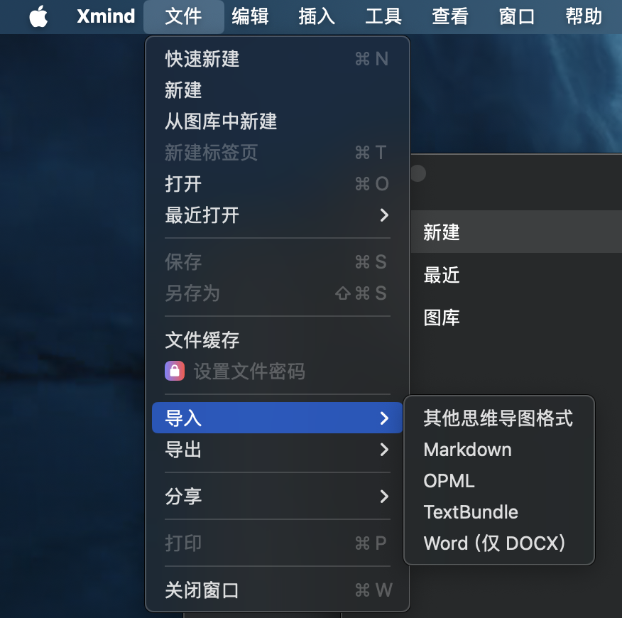
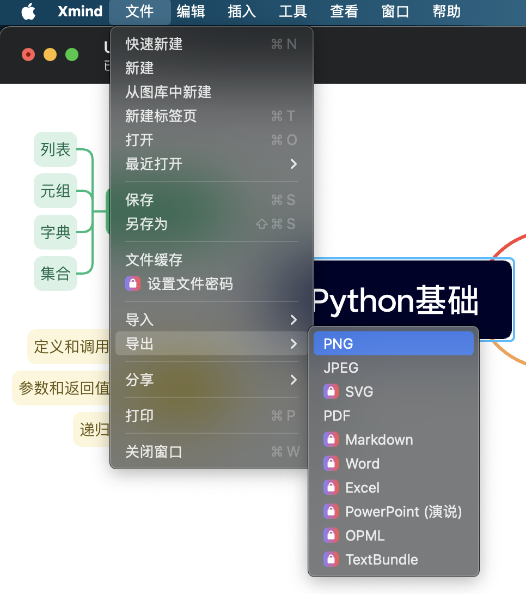

# 3BAO_OF_HBUT_WORKFLOW


3BAO_OF_HBUT_WORKFLOW是一个旨在重构[思维导图](/templates/mindmap/)，[文献阅读](/templates/文献阅读/)，[每科三问](/templates/每科三问/)完成方式的项目，以便：

- 在ddl之前以较短时间完成三宝，提高学习效率。

- 采用markdown格式编写mindmap,操作方便快速，利于扩展。

- 减少重复劳动，提高效率。

## Dependence

- [Markdown](https://markdown.com.cn/basic-syntax/)

- Xmind

- [pandoc](https://pandoc.org)

## Usage

---

### mindmap:

- 思维导图可以被以markdown格式写出，下面是一个示例：

```markdown
- Python基础
  - 语法
    - 变量
    - 数据类型
    - 运算符
  - 控制流
    - 条件语句
    - 循环
  - 函数
    - 定义和调用
    - 参数和返回值
    - 递归
- 数据结构
  - 列表
  - 元组
  - 字典
  - 集合
```

- 一旦完成markdown格式的mindmap，将该文件以markdown格式导入Xmind，导出为png




- 利用pandoc将png转换为pdf

### 文献阅读：

[谷歌学术](https://scholar.google.com)//（未完成）

### 每科三问：

[利用home-work-flow](https://github.com/Clay438/home-work-flow)//（未完成）
